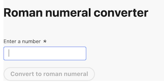
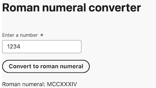
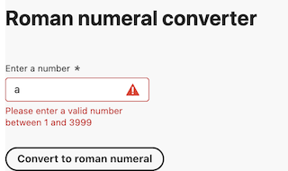

# Roman Numeral App

This project is a web application that converts numbers to Roman numerals. It consists of a client-side React app and a server-side Node.js app.

## Table of Contents

- [Installation](#installation)
- [Usage](#usage)
- [Client](#client)
- [Server](#server)
- [Last thoughts](#last-thoughts)
- [Screenshots](#screenshots)

## Installation

To get started, clone the repository: `git clone https://github.com/mathewbaltes/roman-numeral-app` and run `npm install` in the
`server` and `client` directory.

## Usage
To launch the application, you must run:

```
docker-compose up --build
```
which will launch the client on port :3000 and the 
server on port :8080. 

You can then visit the roman numeral app by visiting: http://localhost:3000 which will launch the app.

## Client
The client was built using React on top of the create-react-app
template, which allowed me to focus on building the functionality
while leveraging existing frameworks.

For the production deployment, we use nginx since it is a fast
http server which is focused strictly on serving static content.

We used Jest since it is an up-to-date testing framework with react-testing-library
to easily test our React components.

We did not:
1) Implement sentry since we need a valid license, however the bones are in place.
2) Implement i18n, however this would be recommended since a lot of customers could be international.

Technologies used:
- React (for rendering the DOM)
- Adobe Spectrum (for the react component library)
- Jest / React Testing Library (for testing)
- Typescript (for type support)
- Sentry (for logging)
- Web Vitals (for metrics)
- create-react-app (for the app template)

### Usage
To run the application, you can navigate to `client/` directory and run `npm run start`.

To test the application,  you can navigate to `client/` directory and run `npm run test`.

## Server
The Server was built using express with node js.  This is a highly performant framework
that allows developers to build node backed services.  We also added support for
rate-limiting and endpoint validation using libraries so we could leverage a standard approach for error handling and prevent abuse of our services.

We did not:
1) Implement sentry since we need a valid license, however the bones are in place. It will support sending all errors to sentry for us to validate.

Technologies used:
- NodeJS/Express (for the server and route creation on the endpoints)
- express-rate-limit (for the server endpoint ratelimiting)
- express-validator (for the server endpoint validation)
- jest (for testing)
- supertest (for testing the nodejs app directly)

### Usage
To run the application, you can navigate to `client/` directory and run `npm run dev`.

To test the application,  you can navigate to `client/` directory and run `npm run test`.

## Last thoughts
1) The adobe spectrum library provides the theme through a Provider, 
we could have also used a react library or code to set the overall app background but out of scope
for the exercise.

2) We could clean up the docker images so that they do not have test files and non-compiled assets bundled.

3) This could have been built as a server-side rendered application, however with larger applications there could be
scaling issues and for this application I chose to keep them separate.

## Screenshots


